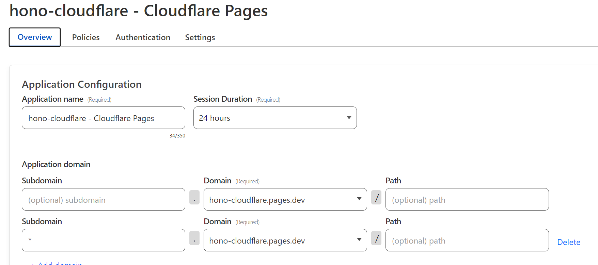

```txt
npm install
npm run dev
```

```txt
npm run deploy
```

---

- create Hono project
  - https://hono.dev/getting-started/cloudflare-pages#client-side
```txt
npm create hono@latest my-app

cd hono-cloudflare

npm install
```

- create "empty" GitHub repository
- connect project to GitHub repository
```txt
git init

git config user.email {your email}

git remote add origin https://{GitHub user name}@github.com/{GitHub user name}/{repository name}
// remote addは新規登録
// remote set-urlは変更
```

```
git add .
git commit
git push
```

- Sign up Cloudflare
  - https://www.cloudflare.com/ja-jp/developer-platform/pages/

- modify `package.json`
  - https://zenn.dev/collabostyle/articles/4c06f9d6660563
```diff
-     "deploy": "$npm_execpath run build && wrangler pages deploy"
+     "deploy": "npm run build && wrangler pages deploy"
```

```txt
npm run build
npm run preview

npm run deploy
// Create project
```

- set Cloudflare Access
